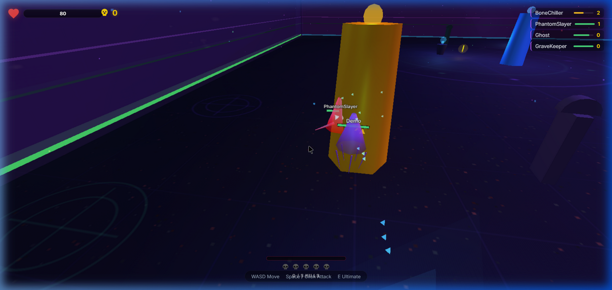
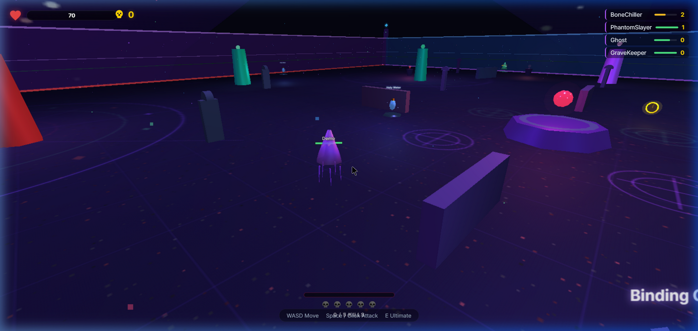
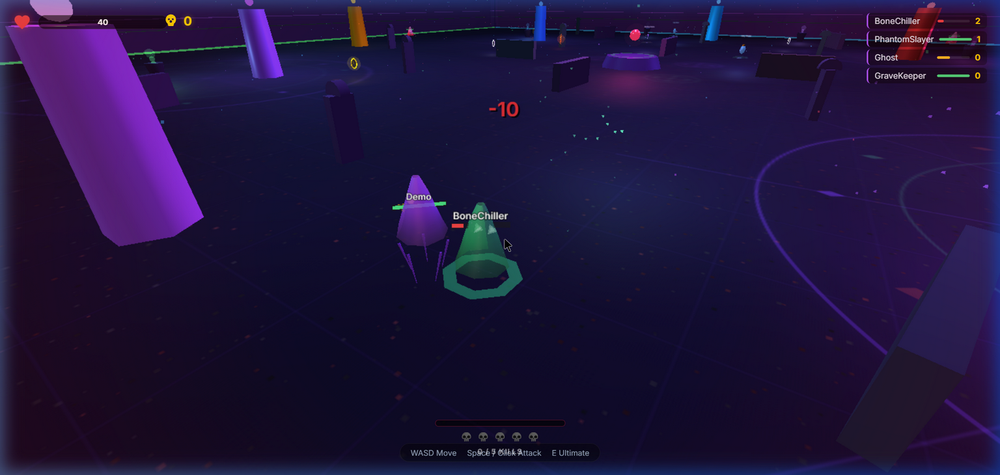

<h1 align="center">Ghost Battles</h1>

<p align="center">
  A highly optimized, fast-paced, 3D multiplayer arena combat game built from scratch using Node.js, Socket.IO, and Three.js.
</p>

<p align="center">
  
  
  
  
  
</p>

---

## Action Highlights

Experience the rapid-action gameplay straight from the browser client, rendered in highly-optimized WebGL.

<p align="center">
  
  
</p>
<p align="center">
  
</p>

---

## Project Overview

Ghost Battles is a real-time multiplayer arena shooter where players control distinct spectral entities fighting for dominance. Designed with an emphasis on brutal speed and high-octane 3D combat, the engine pushes a custom-built physics and collision detection system operating entirely over WebSockets at an aggressive 30 ticks per second.

The game boasts a premium "glassmorphic" user interface overlaying an eerie, retro-inspired, low-poly 3D world. Ghost Battles proves what is technically possible using vanilla web technologies without relying on heavy game engines like Unity or Unreal.

## Core Features

- **Real-Time Multiplayer Architecture:**
  Seamless client-server synchronization using Socket.IO, featuring authoritative server states and client-side interpolation for smooth movement despite network latency.
  
- **Visual Overhaul and Optimization:**
  A modern, sleek interface featuring frosted glass aesthetics with deep shadow layers. The 3D geometry engine has been heavily optimized (tens of thousands of polygons removed via low-poly primitive substitutions) allowing the game to run flawlessly on lower-end devices.

- **Intelligent Bot Integration:**
  Server-side controlled combat bots (such as the CryptLord and ShadowHunter) that aggressively hunt players. The AI uses tactical algorithms for aggro-radius detection, randomized evasion maneuvering, and ultimate ability deployment.

- **Distinct Spectral Classes:**
  Pick a ghost that suits your playstyle:
  - **Wraith:** High mobility and rapid dashing.
  - **Phantom:** Specializes in stealth and temporary invisibility.
  - **Shade:** A defensive anchor providing heavy damage mitigation shields.
  - **Specter:** Crowd control expert focused on area-of-effect stuns.

- **Procedural Weapons and Relics:**
  Weapons like the Silver Dagger, Exorcist's Bible, and Binding Chains spawn dynamically in the arena. Every weapon has custom attributes (damage, cooldown, range) paired with unique geometric particle explosion effects.

- **Algorithmic Audio Synthesis:**
  No external sound assets are loaded. Every auditory cue in the game—from distant thunder loops to weapon impacts—is synthesized procedurally in real-time utilizing the Web Audio API.

---

## Technical Architecture

The architecture relies strictly on lightweight modern frameworks and raw JavaScript capabilities.

- **Backend Network Layer:** Node.js with Express and Socket.IO handling physics loop operations.
- **Frontend Rendering Engine:** Three.js (WebGL) managing lighting, camera projection, and low-poly environment generation. Vanilla JS controls the DOM state and HUD throttling.
- **Persistence Layer:** A fast, synchronized SQLite database (`better-sqlite3`) tracking user statistics, kills, and global leaderboard data across instances.

## Installation and Execution

Setting up Ghost Battles on your local environment requires Node.js (v14+ is recommended).

### Cloning the Repository

```bash
git clone https://github.com/Sambhav-Gautam/GhostBattles.git
cd GhostBattles
```

### Installing Dependencies

```bash
npm install
```

### Starting the Server

Launch the engine's backend game loop and HTTP server:

```bash
node server.js
```

### Connectivity

Once the server initializes, launch your preferred modern web browser and navigate directly to:

```text
http://localhost:3000
```

---

## Keyboard Controls

Ghost Battles relies entirely on keyboard and mouse combinations for fluid movement and combat mapping.

- **W, A, S, D** or **Arrow Keys**: Omnidirectional movement.
- **Mouse Cursor**: Controls camera look angle and targeting.
- **Left Mouse Click**: Deploy primary attack or discharge currently held weapon.
- **Space Bar**: Execute alternative strike action.
- **E**: Activate the ghost's specific special ultimate ability.
- **Shift**: Engage sprinting protocols or specific movement-based skills.

---

## Repository Structure

```text
├── public/                 # Assorted client-side distribution logic
│   ├── assets/             # Documentation media, branding, and assets
│   ├── css/                # Styling, animations, and glassmorphic variables
│   ├── js/                 # Three.js configuration, combat rules, client netting
│   └── index.html          # HUD structures and canvas mount points
├── CODE_OF_CONDUCT.md      # Community behavioral expectations
├── CONTRIBUTING.md         # Open-source pull request and architectural standards
├── SECURITY.md             # Security and vulnerability disclosure protocol
├── server.js               # Authoritative core multiplayer game loop
├── db.js                   # Asynchronous interface for SQLite operations
└── package.json            # Node modular dependency definitions
```

---

## Contributing Guidelines

Ghost Battles embraces open-source contributions. Prior to submitting a functional pull request, please review the expectations delineated inside `CONTRIBUTING.md`. Code implementations must abide by standard JS formats and prioritize maintaining 60 frames-per-second performance.

Please ensure adherence to our detailed `CODE_OF_CONDUCT.md`.

## Open Source License

This codebase is distributed openly under the [MIT License](LICENSE). Review the attached license document for usage permutations and liabilities.
